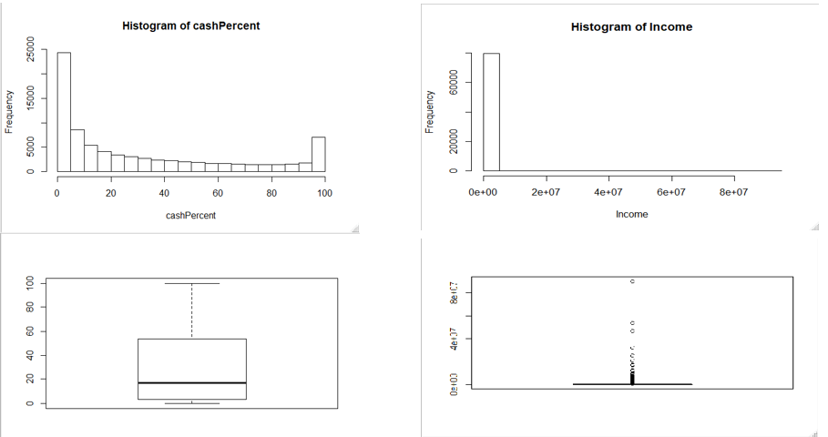
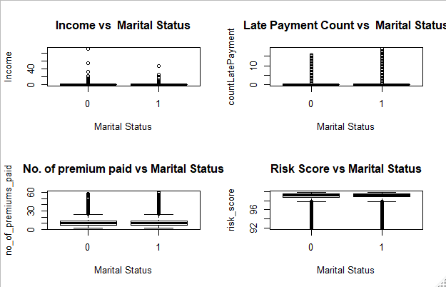
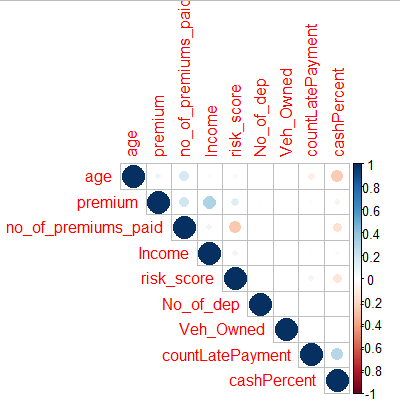
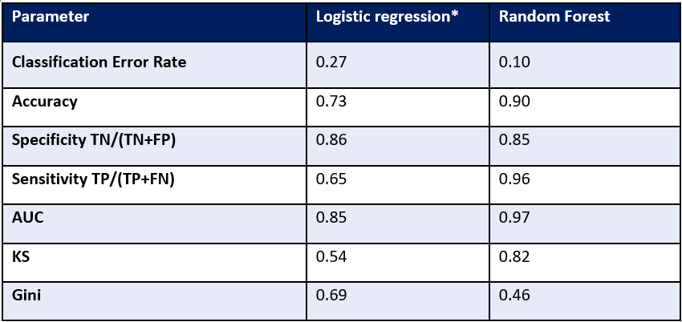
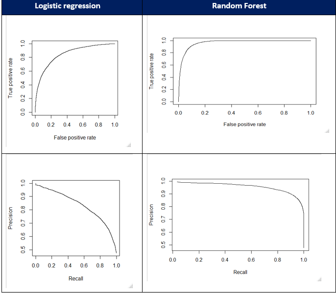

# Insurance-Default-Prediction
Insurance is a form of risk management tool which allows the insured party to hedge the risk of a uncertain loss.It is vital for companies to identify the key factors that influence the premium payment decision to maximise their profits and maintain their customers and business.

## About the Project
The objective of this project is to predict the probability that a customer will default the premium payment, so that the insurance agent can proactively reach out to the policy holder to follow up for the payment of premium. Simultaneously, it will also help understand customer demographics which are more likely to default and to price the premium amount in accordance to the same.

## Data overview & Exploratory Data Analysis
The dataset consists of <b>17 variables and 79853</b> customer observations.Data has a mix of Indicator and Continuous variables which mainly covers Customer’s demographic information, premium payment related behavior and Risk profiling.

#### Data Analysis: Univariate

  
•Values range from 0 to 100 with majority of data points falling &emsp;                           • Data has a wide range of 24,030 to 90,262,600 (right skew) 
in the lower range of 0% to 5%   &emsp; &emsp; &emsp;&emsp;&emsp;&emsp;&emsp;&emsp;&emsp;&emsp;&emsp;&emsp;&emsp;&emsp;&ensp;            • Mean = 208847   
• Mean = 31.43% &emsp;&emsp;&emsp;&emsp;&emsp;&emsp;&emsp;&emsp;&emsp;&emsp;&emsp;&emsp;&emsp;&emsp;&emsp;&emsp;&emsp;&emsp;&emsp;&emsp;&emsp; • Data has too many outliers                                                                         
• Data has outliers
 

#### Data Analysis: Bivariate
• Marital status vs Income, Late Payment, No of premium paid & Risk score

  
 <b>No significant difference across parameters between Married and Unmarried customers.</b>
 

 
 #### Data Analysis: Multivariate
 

  
There is no high correlation among variables, in general. However, from the above we can infer that: Customers making higher % of cash payment are likely to make more delayed payments and are likely to have lower Risk Score. Higher age customers have paid more number of premiums but lesser premium amount in cash. Higher Income customers are likely to pay higher Premium.
 

 
 ## Modelling 
 <b>Logistic Regression, Random Forest, K-Nearest Neighbours and Naive Bayes</b> were used.
 <body>
    <table>
        <tr k>
            <th>Parameter </th>
            <th>Logistic Regression</th>
            <th>Random Forest </th>
            <th>K-Nearest Neighbours</th>
            <th>Naive Bayes</th>
            <th>With Bagging</th>
        </tr>
        <tr>
            <td>Classification Error
            </td>
            <td>0.27</td>
            <td>0.10
            </td>
            <td>0.37</td>
            <td>0.25</td>
            <td>0.17</td>
        </tr>
        <tr>
            <td>Accuracy	</td>
            <td>0.73</td>
            <td>0.90</td>
              <td>0.63</td>
              <td>0.74</td>
            <td>0.83</td>
        </tr>
        <tr>
            <td>Loss</td>
            <td>0.41</td>
            <td>0.04
            </td>
              <td>0.57</td>
              <td>0.37</td>
            <td>0.26</td>
        </tr>
        <tr>
            <td>Oppurtunity Loss</td>
            <td>0.11</td>
            <td>0.15
            </td>
              <td>0.14</td>
              <td>0.13</td>
            <td>0.07</td>
        </tr>
    </table>
</body>
 Top 2 models per above comparison are Logistic Regression and Random Forest.   
 
 Let’s further compare these 2 models:
 

 
  

  
 ROC curves and Precision Recall curves were also plotted to compare performance measures. 
 

 
  

  
 Interpretation of Model Measures: 
•	Random Forest has a lower CER 
•	Random Forest has a higher accuracy 
•	Logistic Regression has a lower specificity. 
•	Logistic Regression has a lower sensitivity 
•	Logistic Regression has a lower AUC 
•	Random Forest has a higher K-S 
•	It can be seen that the ROC curve for Random forest is closer to the left corner and the PRC curve is closer to the right corner. 

Therefore, from above comparisons it can be seen that <b>Random Forest</b> has overall better performance indicators.

 
